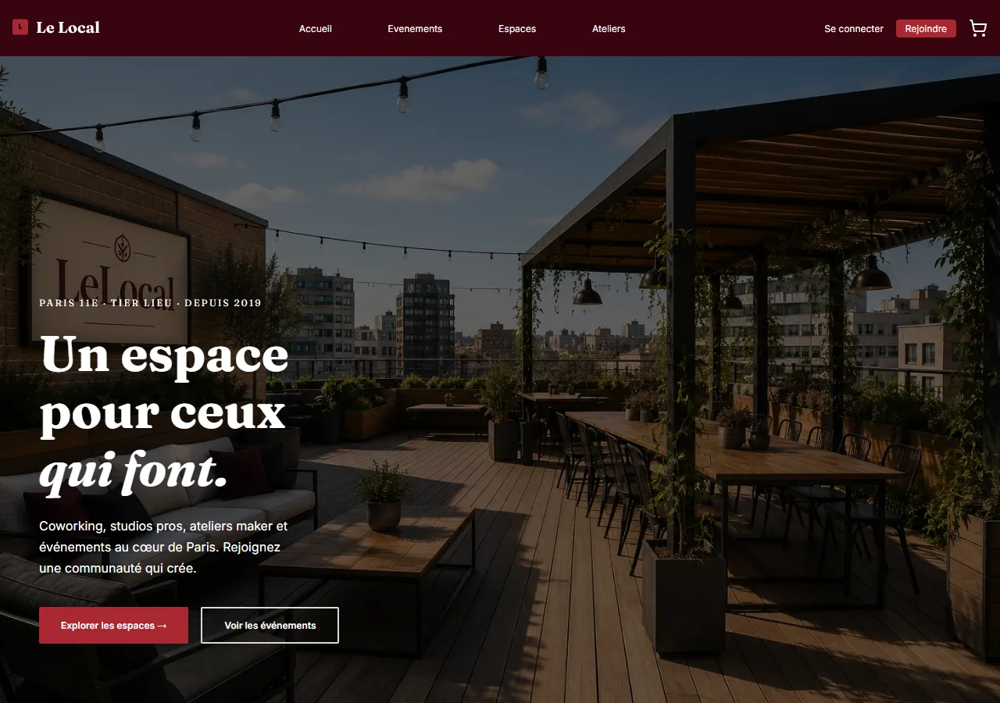
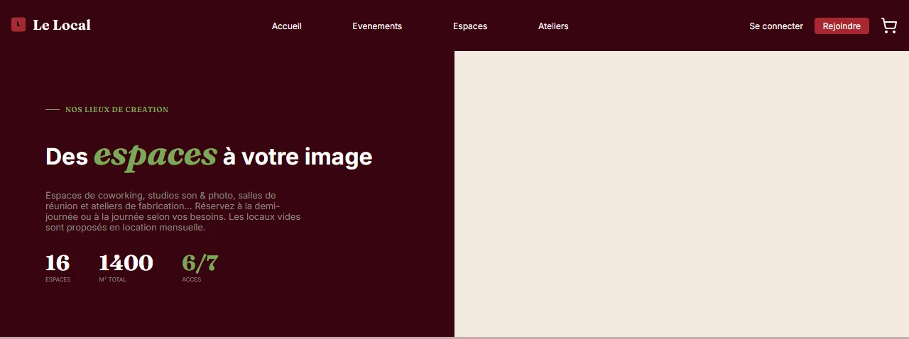
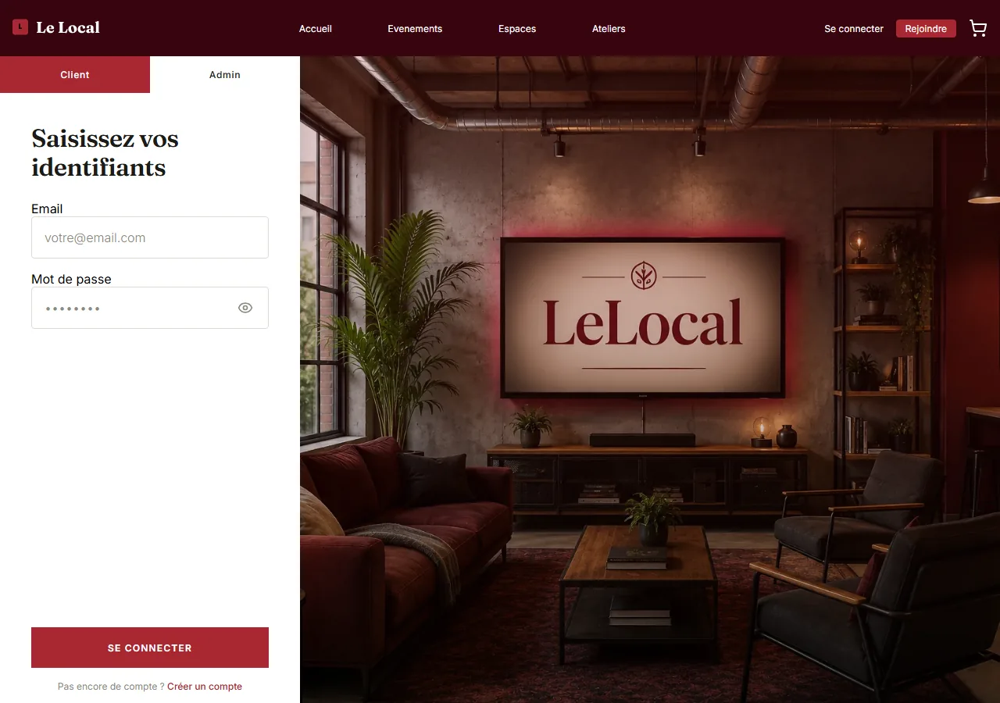

# Le Local — réservation d'un tiers-lieu

[**Voir le produit en ligne →**](https://lelocal.lucasguilhot.fr) · [Étude de cas complète](https://lucasguilhot.fr/projets/le-local) · [Portfolio](https://lucasguilhot.fr)

`React` `TypeScript` `Express` `MySQL` `Stripe` `Docker`

> **Projet d'équipe repris seul.** Le code venait d'un projet collectif de formation :
> il fallait le sécuriser, le tester et le rendre déployable sans tout réécrire.
> **213 tests** ajoutés là où il n'y en avait aucun, image Docker ramenée de
> **113 Mo à 8,7 Mo**, routes sécurisées, migrations versionnées, réservations
> concurrentes traitées.
>
> Comptes de démonstration : `nina.richard@lelocal.fr` / `demo-admin-2026` (administration),
> `lucie.marie655@voila.fr` / `demo-client-2026` (client).

---

Plateforme de réservation d'un tiers-lieu parisien : espaces de coworking,
studios son et photo, salles de réunion, ateliers de fabrication, locaux vides
en location mensuelle, et les événements organisés sur place.

Un visiteur parcourt les espaces et les événements, réserve un créneau, passe
au panier, paie par Stripe et retrouve ses factures ; l'équipe du lieu suit
l'occupation, les réclamations et les demandes d'événement depuis un tableau
de bord d'administration.

Projet d'équipe de la Wild Code School (projet 3), repris et refondu pour être
réellement déployable : sécurité, migrations, Docker, CI et tests.







> Captures prises sur le client de développement, **sans base de données** :
> les listes alimentées par l'API (grille des espaces, événements à venir) y
> apparaissent donc vides. Seules les pages publiques sont montrées — les
> tableaux de bord exigent une session.

## Architecture

- **Monorepo npm** à deux workspaces : `client` (React 19 + Vite + TypeScript)
  et `server` (Express 4 + MySQL 8 + TypeScript).
- **Serveur en trois couches** : `router.ts` déclare les routes, les
  *actions* (`server/src/modules/<domaine>/…Actions.ts`) portent les règles
  métier et les codes HTTP, les *repositories* portent le SQL. Aucune requête
  SQL hors d'un repository.
- **Session** : JWT signé HS256, transporté par un cookie `ww_session`
  httpOnly, `SameSite=Lax`, `Secure` en production. Le client ne lit jamais
  le jeton ; `apiFetch` envoie simplement `credentials: "include"`.
- **Autorisation** : `requireAuth` (401) et `requireAdmin` (401 puis 403)
  côté serveur ; `RequireRole` côté client pour éviter d'afficher un écran
  qui serait refusé de toute façon. Les prix et l'identité de l'acheteur sont
  toujours relus en base, jamais pris dans le corps de la requête.
- **Base** : migrations numérotées dans `server/database/migrations/`,
  appliquées une seule fois chacune et notées dans `schema_migrations` ; le
  runner refuse tout fichier contenant `DROP` ou `TRUNCATE`.
- **Production** : un seul conteneur. Express sert l'API et le client
  construit (`client/dist`) avec repli sur `index.html`, donc une seule
  origine — pas de CORS, pas de cookie tiers. Les uploads vivent sur un
  volume.

## La réservation, sans double réservation

C'est le cœur du projet. Deux personnes qui cliquent au même instant sur le
même créneau ne doivent pas obtenir la même salle.

1. `POST /api/bookings` ouvre une transaction sur une connexion dédiée.
2. Elle verrouille la ligne de l'espace : `SELECT * FROM space WHERE id = ?
   FOR UPDATE` — la seconde requête attend, elle ne lit pas un état périmé.
3. Sous ce verrou, elle relit le prix en base, puis compte les places déjà
   prises pour ce créneau (ou les périodes qui se chevauchent, pour un local).
4. Si la place existe, elle écrit l'activité et la ligne de panier, puis
   `COMMIT` ; sinon `ROLLBACK` et **409**.
5. Le verrou tombe au commit : la requête concurrente reprend, voit la place
   occupée, et reçoit son 409.

Le test d'intégration `server/tests/booking.int.test.ts` réserve « La
Rotonde » puis retente la même réservation : la seconde doit être refusée.
Il tourne en CI contre un vrai MySQL 8.

## Lancer le projet en local

### Avec Docker (le plus simple)

```sh
cp .env.sample .env        # puis remplir JWT_SECRET
docker compose up --build
docker compose exec -e ALLOW_SEED=1 app node dist/bin/seed.js   # une seule fois
```

L'application est sur <http://localhost:3310> (client et API sur la même
origine, comme en production). Les migrations sont jouées au démarrage du
conteneur.

### Sans Docker (MySQL déjà installé)

```sh
npm install
cp server/.env.sample server/.env    # remplir DB_*, JWT_SECRET, CLIENT_URL
cp client/.env.sample client/.env
```

La base doit exister (`CREATE DATABASE wildwalker;`) : les migrations ne la
créent pas, et ne la suppriment jamais non plus.

```sh
npm run db:migrate     # applique les migrations non encore jouées
npm run db:seed        # données de démonstration (optionnel)
npm run dev            # client sur :3000, API sur :3310
```

Pour faire évoluer le schéma, on **ajoute** un fichier
(`0002_ma_modification.sql`) ; on ne modifie jamais un fichier déjà appliqué.

### Commandes

| Commande | Description |
|---|---|
| `npm run dev` | Client et serveur dans un seul terminal |
| `npm run db:migrate` | Applique les migrations en attente |
| `npm run db:seed` | Charge les données de démonstration (refusé en production sans `ALLOW_SEED=1`) |
| `npm run build` | Compile le client (`client/dist`) et le serveur (`server/dist`) |
| `npm start` | Démarre le serveur compilé (`node dist/src/main.js`) |
| `npm run check` | Vérification complète : Biome sur tout le dépôt (pas seulement l'index git) + types des deux workspaces |
| `npm test` | Tests du client (Vitest) et du serveur (Jest) |

Sans configuration, ou sans MySQL joignable, le serveur s'arrête avec un
message explicite et un code de sortie 1 plutôt qu'avec une pile d'appel.

## Comptes de démonstration

Mots de passe volontairement publics — ce dépôt est une démonstration.

| Rôle | Identifiant | Mot de passe |
|---|---|---|
| Administration | `nina.richard@lelocal.fr` | `demo-admin-2026` |
| Client | `lucie.marie655@voila.fr` | `demo-client-2026` |

Les 2 comptes `admin` et les 25 comptes `client` du seed partagent ces deux
mots de passe. Pour les changer : ajuster `server/bin/hash-demo-passwords.ts`,
lancer `npx tsx bin/hash-demo-passwords.ts` depuis `server/`, puis commiter le
`seed.sql` obtenu.

## Tests

```sh
npm test                         # client (Vitest) + serveur (Jest)
npm test --workspace=server      # serveur seul
npm test --workspace=client      # client seul
```

- **Serveur (Jest + supertest)** : middlewares d'authentification et de rôle,
  garde d'origine, calcul du montant Stripe côté serveur, preuve de paiement
  exigée avant réservation (402 sans intention `succeeded` au bon montant),
  propriété des lignes de panier (IDOR → 404), validation de la quantité et
  re-contrôle de capacité au `PATCH`, compteur de numéros de facture,
  limite de débit sur la connexion, refus d'envoi de fichier (400 lisible),
  sonde de santé, attribut `Secure` du cookie. Dépôts, Stripe et pool MySQL
  mockés.
- **Client (Vitest + Testing Library)** : `RequireRole`, `apiFetch`
  (credentials, URL relative en production), formulaires de connexion et
  d'inscription, panier, paiement.
- **Intégration (CI seulement)** : `server/tests/*.int.test.ts` tourne contre
  un MySQL 8 réel, migré et seedé — réservation de bout en bout, et
  concurrence : deux paiements simultanés du même panier, deux réservations
  simultanées du même créneau, numéros de facture concurrents. Ces suites
  s'ignorent d'elles-mêmes quand `DB_HOST` n'est pas renseigné.
- **Image Docker (CI seulement)** : l'image est construite puis **lancée**
  avec un MySQL, et interrogée — `/api/health` à 200 avec `db:true`, `/` qui
  sert bien le client, connexion d'un admin de démo suivie d'un appel à une
  route d'administration (200), puis le même appel avec un client (403).

Le poste de développement n'ayant ni Docker ni MySQL, la CI
(`.github/workflows/ci.yml`) est le seul endroit où l'image et les migrations
sont réellement exécutées.

## Limites connues

Trois points relevés à la revue finale et laissés en l'état, sciemment. Ils
sont documentés ici plutôt que corrigés à la hâte : chacun demande un choix
d'architecture, pas un correctif.

- **Limite de débit : ordre d'éviction.** `Middlewares/rateLimit.ts` garde
  ses compteurs en mémoire et les purge à l'insertion, sans tenir de file
  LRU. Sous un afflux d'adresses distinctes, l'entrée évincée n'est pas
  forcément la plus ancienne, et un attaquant patient peut faire sortir la
  sienne du cache. Acceptable pour un mono-conteneur ; la vraie réponse est
  un magasin partagé (Redis) le jour où l'application tourne sur plusieurs
  instances — ce qui règle du même coup le fait que les compteurs ne sont
  aujourd'hui pas partagés entre processus.

- **Ordre de verrouillage.** Les transactions de réservation posent leurs
  verrous dans l'ordre où le code les rencontre (`cart`, puis `space`, puis
  `activity` selon le chemin). Deux chemins qui les prendraient dans un
  ordre différent pourraient se bloquer mutuellement ; MySQL détecte alors
  l'interblocage et annule l'une des deux transactions — l'utilisateur voit
  un 500, pas une corruption. Fixer un ordre unique et documenté pour tout
  le code vaudrait mieux qu'y compter.

- **`:userId` dans les URL du tableau de bord client.** Les routes
  `/api/dashboard/client/:userId/...` portent encore un identifiant que le
  serveur **ignore** : chaque action lit `req.user.id`, jamais le paramètre
  (le panier, lui, a déjà perdu le sien). Il n'y a donc pas de faille, mais
  une URL qui ment sur ce qu'elle fait — et invite le prochain
  développeur à s'en servir. À retirer, côté client compris.

## Déploiement

Un seul conteneur derrière Coolify, avec une ressource MySQL 8 et un volume
pour les uploads : voir **[`deploy/coolify.md`](deploy/coolify.md)** pour la
procédure complète (variables d'environnement, argument de construction
Stripe, seed unique, domaine et HTTPS).

## Structure

```plaintext
wildwalker/
├── client/                 # React + Vite
│   └── src/{components,pages,hooks,types}
├── server/
│   ├── src/
│   │   ├── Middlewares/    # auth, rôle, origine, limite de débit
│   │   ├── modules/        # <domaine>/…Actions.ts + …Repository.ts
│   │   ├── upload/         # multer : types acceptés, taille, nom généré
│   │   ├── app.ts          # middlewares, statique, gestion d'erreurs
│   │   ├── main.ts         # validation de l'environnement, démarrage
│   │   └── router.ts
│   ├── bin/                # migrate.ts, seed.ts, hash-demo-passwords.ts
│   ├── database/           # migrations/, seed.sql, client.ts
│   ├── public/             # fichiers statiques SEULEMENT : images, uploads
│   └── tests/
├── deploy/coolify.md
├── docs/screenshots/
├── Dockerfile              # multi-stage : deps → build → runner non-root
└── docker-compose.yml      # app + MySQL 8, pour le développement
```

## L'équipe

Projet réalisé à la Wild Code School par **Aude Charrier**,
**Nico Semenadisse**, **Brice Kutuk**, **Lucas Guilhot**,
**Coline Rabemihoatra** et **Leo Fleury** — conception, design, front React et
API Express.

Refonte 2026 (sécurité, migrations, Docker, CI, tests, documentation) :
Lucas Guilhot.

## Licence

MIT — voir [`LICENSE.md`](LICENSE.md).
